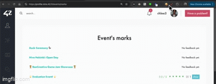

<h1 align="center">
	✏️ 42-event-sorter
</h1>

<p align="center">
	<b><i>Chrome extension to help you to sort 42 events.</i></b><br>
</p>

<h3 align="center">
		<a href="#-about-the-project">About</a>
		<span> · </span>
		<a href="#-features-of-the-project">Features</a>
		<span> · </span>
		<a href="#-instructions">Instructions</a>
		<span> · </span>
		<a href="#-learning-goals">Future Goals</a>
</h3>

---

## 💡 About the App

> 42-event-sorter helps you to easier browse the future/past events where the funtionality original 42 intra web page does not provide.



## 🌟 Features of the App
- Fetching data from 42 apis, including fetching events and feedbacks.
- Mulnipulate the web element by javascript alongside with service worker.

## 🔧 Instructions
### step 1. clone the project
```
git clone https://github.com/LeeRichi/42_event_sorter.git
```
### step 2. Go to: chrome://extensions/ <br> copy and paste to your chrome: 👇️
```
chrome://extensions/
```
#### a. Enable "Developer mode" at the top right.
#### b. Click unpacked, upload the cloned folder

### step 3. Go to: [42 page](https://profile.intra.42.fr/events/marks) 👈️click here or copy:
```
https://profile.intra.42.fr/events/marks
```
Sort the events you want.

### ...or if want to hear my voice, here's video instruction.
https://youtu.be/OJNsc3dDt6U

## 🎯 Future Goals
- Implement the POST feature for writing feadbacks nad subscribe.
- Of course I am trying to publish in store but google takes their time to verify my account.

